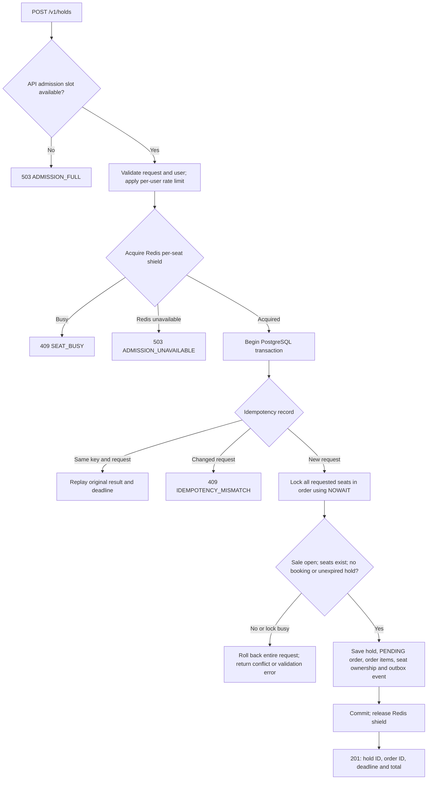
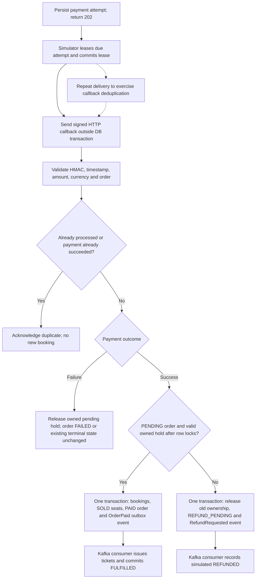

# Application flow

This describes the implemented backend. See the [system diagrams](system-diagrams.md), [technology stack](tech-stack.md), and detailed [concurrency contract](architecture.md).

## Customer and API journey

| Step | Request | Result |
|---|---|---|
| Browse events | `GET /v1/events` | Event metadata from PostgreSQL |
| Browse seats | `GET /v1/events/{event_id}/seats` | Pre-warmed Redis snapshot; availability is advisory |
| Refresh changed seats | `GET /v1/events/{event_id}/seat-deltas?since=VERSION` | Changed current seat states from the cached snapshot; client polls this endpoint |
| Reserve | `POST /v1/holds` with user token and `Idempotency-Key` | Atomically creates a hold, pending order and price snapshots for 1–8 seats |
| Resolve checkout order | Optional `POST /v1/orders` with hold ID and idempotency key | Returns the order already created with the hold |
| Start simulated payment | `POST /v1/orders/{order_id}/payments` with idempotency key | Persists one payment attempt and returns HTTP 202 |
| Receive callback | `POST /v1/webhooks/payments` | Validates signed payment outcome and commits booking or refund decision |
| Collect result | `GET /v1/orders/{order_id}` | Customer polls for FULFILLED and issued tickets, or a failure/refund state |
| Release early | `DELETE /v1/holds/{hold_id}` | Releases seats still owned by this hold; confirmed bookings cannot be released |

A seat hold is not a confirmed booking. Starting checkout or payment does not extend the hold deadline. Successful payment must be processed while the hold is valid.

## Reservation flow

The Redis shield is released after the database transaction exits, including replay and rollback paths. Failed authentication, malformed requests and rate limiting return their corresponding errors before reservation proceeds.

The database time check occurs **after** seat locks are acquired. If any requested seat is unavailable, the entire multi-seat transaction rolls back. The final booking table separately enforces unique `(event_id, seat_id)`.

Idempotency is scoped to actor, operation and key. Concurrent duplicates can receive a transient busy response while the original request is running; retrying the same key after completion replays its committed result. A replay does not renew a hold.

## Payment and fulfillment flow

Invalid signatures or mismatched payment data are rejected. The diagram's mutation branches apply to a new callback; previously successful payments cannot regress.

The simulator defaults to three deliveries of the same callback. Tests also cover distinct callback IDs for one payment and simultaneous callbacks. Delivery leasing and acknowledgements allow recovery if the simulator stops after sending a callback.

### Transaction boundaries

| Transaction | Atomic changes |
|---|---|
| Reservation | Idempotency record/result, hold, pending order, items, seats, SeatsChanged event |
| Checkout resolution | Idempotent response for the existing order; no second order |
| Payment initiation | One payment attempt and idempotent response |
| Simulator dispatch lease | Claim due work; commit before HTTP request |
| Callback | Callback deduplication, payment state, booking or refund decision, order/seat state, outbox events |
| Fulfillment | Consumer inbox entry, tickets, FULFILLED state and TicketsIssued event |
| Simulated refund | Consumer inbox entry, refund state and REFUNDED order |
| Expiry/release | Clear only current ownership for that hold and write a seat-change event |

## Expiry and races

- Default hold lifetime: **120 seconds**.
- Expired inventory is reclaimable during reservation, even while the cleanup worker is stopped.
- Cleanup uses SKIP LOCKED when selecting a candidate order and NOWAIT for subsequent locks.
- A late successful payment creates one refund request; it cannot reclaim seats from a newer owner.
- Cleanup and callbacks clear only seats that still reference their own hold.
- Explicit release marks an active hold RELEASED and a pending order EXPIRED. A later success follows the refund path.
- Cached HELD state can briefly lag logical expiry; clients receive the deadline, and PostgreSQL decides whether a new hold is allowed.

## Fail-fast responses

| Response | Meaning / client behavior |
|---|---|
| 201 | Hold/order result committed, or an idempotent hold result replayed |
| 202 | Simulated payment attempt accepted for asynchronous delivery |
| 409 | Seat/resource conflict, expired hold or idempotency mismatch; inspect the error code |
| 429 | Per-user rate limit exceeded |
| 503 | Admission, cache or database unavailable/full; bounded rejection |

There is no automatic customer retry loop. A client can let the user choose another seat or deliberately retry the same idempotency key after an uncertain request outcome. See [load-test results](load-test-report.md) for measured rejection rates and latency limits.

Implementation: [API](../src/ticketing/api.py), [use cases](../src/ticketing/application/reservations.py), [reservation adapter](../src/ticketing/infrastructure/reservations.py), [workers](../src/ticketing/workers.py).
