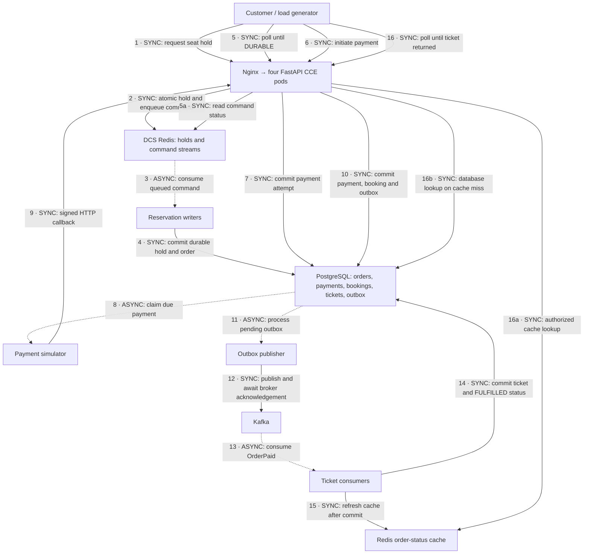

# CCE hourly ticket-sales milestone — 9 October 2026

The experiment issued **302,262 unique paid tickets inside one hour**, exceeding the 300,000 target. It ran from **08:49:33 to 09:49:33 Bangkok time**. Full production qualification remains failed: one customer payment returned HTTP 503 and strict telemetry coverage was incomplete.

This is an evidence-only publication. The tested application, CCE adapters, worker changes and migrations remain on the [pinned experimental revision](https://github.com/chawansit/flash-ticketing/tree/750ad8a4bf680a8440c001f2300b7fa8d56d8e77). Merging these documents does not deploy that application or establish that main can reproduce this result. The source-bound experiment used backend revision `deb330ec91e553640d1d0ba10e92aa8f29cd86dc`.

| Measure | Executed result |
| --- | --- |
| Offered workload | 84 journeys/s continuously for 3,600 seconds |
| Scheduled / dispatched | 302,400 / 302,400 |
| Generator drops / customer retries | 0 / 0 |
| Unique paid-and-issued tickets inside the hour | 302,262 |
| Tickets inside the conservative inner window | 302,037; excludes two seconds at each boundary |
| Customer-confirmed successful journeys, including completion tail | 302,399 |
| Failed customer journeys | 1 payment HTTP 503; 0.000330688% |
| Independent terminal reconciliation | 302,399 payments, bookings and tickets; one expired unpaid order |
| Duplicate bookings / lost successful payments | 0 / 0 in the audited cohort |
| Queue drain / original topology restoration | Passed |
| Overall recorded scope | FAILED_RESTORED; original failed result preserved |

## Tested architecture

Four FastAPI pods on CCE, each with 1 vCPU and 1 GiB, received requests through existing ECS Nginx routing. API database access used a private bridge to the existing PgBouncer and RDS PostgreSQL. Each API had two general and two payment connections; PgBouncer retained 24 server connections. The 20 acquisition slots per API are bounded waiting/admission capacity, not 20 database connections.

DCS Redis provided atomic holds, reservation command streams and caches. Existing ECS background services included three reservation writers, six Kafka consumers, an outbox publisher, maintenance/reconciliation and one payment simulator with eight concurrent deliveries. API callback confirmation was synchronous (`PAYMENT_CONFIRMATION_ASYNC=0`); Kafka ticket issuance remained asynchronous. A configured confirmation worker did not receive asynchronous receipts in this profile.

## Numbered application flow

Solid arrows mark synchronous operations: the caller waits for that operation. Dashed arrows mark queued or scheduled background work. A synchronous operation inside a background worker does not make the overall customer journey synchronous. Database arrows below include the relevant PgBouncer route; CCE API calls additionally traverse the private bridge.

The hold request returns 202 after step 2; the customer waits for durable persistence before step 6. Payment initiation returns 202 after step 7. The callback waits for step 10's financial commit before acknowledging success. Ticket issuance continues through Kafka, and the customer receives the ticket through authorized status polling.

## Workload and limits

Each authenticated simulated customer requested one predetermined seat, waited for durable persistence, initiated payment and polled until one ticket appeared. The run used two generator shards with at most 500 active journeys in total, no customer retries, and approximately 531 HTTP attempts/s including polling.

The fixture had 1,008 shows of 300 seats, allocated as twelve consecutive five-minute groups of 84 shows. Paid journeys targeted distinct seats. Separate safety checks exercised 100 competing hold attempts, idempotency, authorization, duplicate callbacks and post-TTL payment durability. This was not a simultaneous flash-sale opening, heavy seat-map browsing test, or concentrated 18,000-seat-show qualification.

Payment requests explicitly set confirmation delay to zero. Real network and processing latency remained. The banking-style simulator delay profile was not applied to this frozen workload. Duplicate callback delivery was tested in the safety protocols; paid traffic requested one delivery per payment.

Reported customer p95 values are the worst shard's p95, not a pooled percentile: hold HTTP 18.80 ms, durable hold 1,227.24 ms, payment HTTP 91.79 ms, payment-to-ticket 1,654.66 ms, and hold-to-ticket 2,815.51 ms.

## Failed gates and recovery

Recovered counters classified one customer-payment 503 and three callback 503s as database PoolTimeout. The callbacks subsequently recovered, and every successful payment reconciled with a unique ticket. These counters establish the failure class; they do not prove which database operation caused temporary connection occupancy.

The 264,435,078-byte trace exceeded the runner's 128-MiB transfer ceiling. A separate bounded read-only recovery verified and retrieved it. It contained 3,419 samples with 77 gaps above two seconds; the largest gap was 3.022377 seconds. Strict database continuity and native API CPU coverage remain failed. This evidence does not establish maximum capacity or further headroom.

The original financial expectation guard rejected the hourly count. Independent recovery subsequently verified all financial relationships, elapsed hold TTL, both safety payments, empty global queues, retired owned shows, removed CCE resources, idle generator and the restored original ECS topology. The paid-test consumer count was six; the restored normal topology correctly had one consumer. The original failed result and consumed paid allowance were preserved.

Four timed terminal-recovery attempts totalled 436.827 seconds; late trace recovery took 42.219 seconds. Three earlier failed read-only attempts lack exact elapsed receipts. Currency spending and complete wall-clock accounting were not measured.

## Evidence and review scope

- [Hourly results](cce-hourly-qualification-2026-10-09.json)
- [Passing five-minute prerequisite](cce-acquisition-headroom-comparison-2026-10-09.json)
- [ADR0232: hourly qualification](../../adr/0232-bounded-hourly-paid-ticket-qualification.md)
- [ADR0234: acquisition headroom](../../adr/0234-bounded-cce-acquisition-headroom.md)
- [ADR0235: terminal audit and recovery](../../adr/0235-hourly-terminal-audit-and-recovery.md)
- [Experimental implementation and earlier decision history](https://github.com/chawansit/flash-ticketing/tree/750ad8a4bf680a8440c001f2300b7fa8d56d8e77/docs/adr)

The imported ADRs retain their original filenames and chronological experiment statements. References to experimental scripts, private evidence and earlier decisions refer to that pinned implementation, not to newly integrated main code. Raw traces, customer tokens, credentials, private manifests and cloud configuration are excluded.

The experimental hourly integration passed 826 local tests with one platform skip in 24.76 seconds. Those results belong to the experimental revision. This documentation PR separately validates report provenance, numerical consistency, links, naming and unchanged application/migration/configuration files; it does not claim new backend tests or a passing production qualification.
