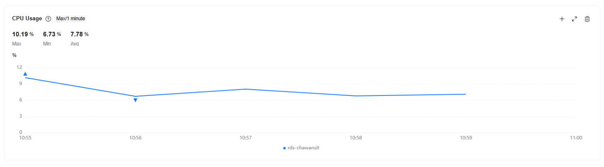
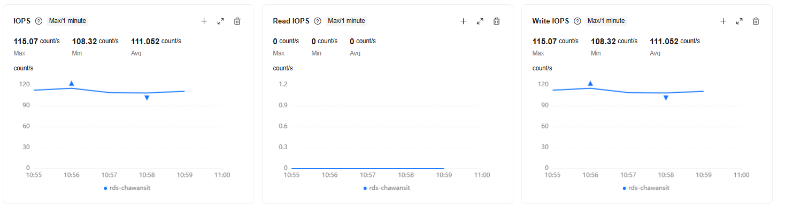
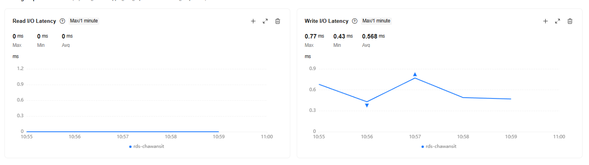
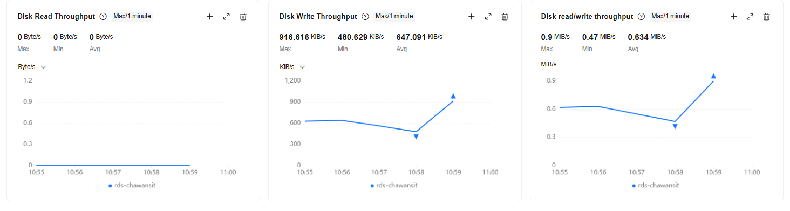
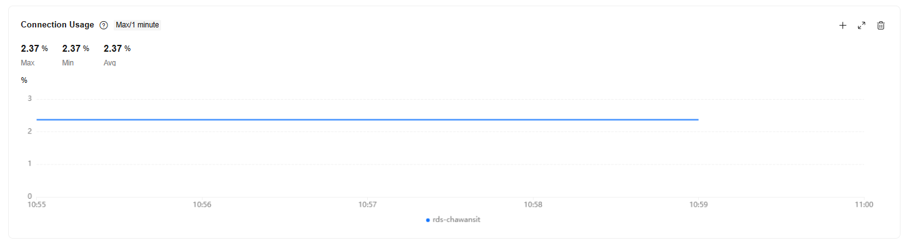
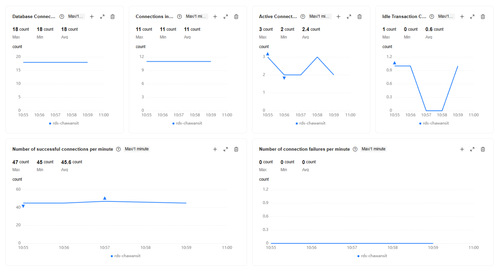
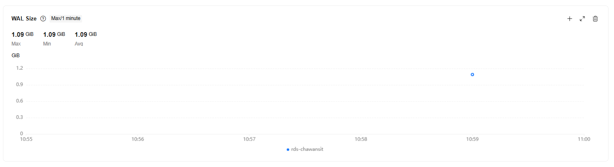

# Huawei RDS provider metrics at the 750 RPS spike

## Observation window

- Date: 2026-09-13
- Window: 10:55-11:00 UTC
- Huawei Cloud aggregation: maximum over one-minute intervals
- Application pressure events: 10:57:18.249 UTC and 10:58:39.249 UTC
- Source: Huawei Cloud RDS monitoring screenshots supplied by the operator

## Observed values

| Metric | Minimum | Average | Maximum | Observation |
| --- | ---: | ---: | ---: | --- |
| CPU usage | 6.73% | 7.78% | 10.19% | No sustained CPU saturation |
| Total IOPS | 108.32/s | 111.052/s | 115.07/s | All observed IOPS were writes |
| Read IOPS | 0/s | 0/s | 0/s | Reads were served without measured disk reads |
| Write I/O latency | 0.43 ms | 0.568 ms | 0.77 ms | No storage-latency saturation in the one-minute series |
| Read I/O latency | 0 ms | 0 ms | 0 ms | Consistent with zero measured disk read IOPS |
| Disk write throughput | 480.629 KiB/s | 647.091 KiB/s | 916.616 KiB/s | Low relative storage load |
| Combined throughput | 0.47 MiB/s | 0.634 MiB/s | 0.9 MiB/s | No throughput saturation |
| Connection usage | 2.37% | 2.37% | 2.37% | Far below the configured connection ceiling |
| Database connections | 18 | 18 | 18 | Stable throughout the window |
| Connections in use | 11 | 11 | 11 | Stable throughout the window |
| Active connections | 2 | 2.4 | 3 | Low RDS-side execution concurrency |
| Idle transaction connections | 0 | 0.6 | 1 | At most one observed |
| Successful connections/minute | 45 | 45.6 | 47 | Stable connection creation activity |
| Connection failures/minute | 0 | 0 | 0 | No RDS connection rejection |
| WAL size | 1.09 GiB | 1.09 GiB | 1.09 GiB | Size only; this does not measure WAL write latency |

## Interpretation

The provider metrics rule out sustained RDS CPU, storage, IOPS, throughput and connection-capacity saturation during the application pressure events. Both API replicas nevertheless reached their local database pool limits while the RDS reported only two to three active connections. The remaining candidates are a short application-to-database service-time stall, connection lifecycle time, PgBouncer wait, network delay or API runtime scheduling.

The Huawei series uses one-minute buckets. It cannot exclude a 10-150 ms transient inside a bucket. It does show that increasing the RDS instance size or connection limit is not supported by this evidence.

## Screenshots

