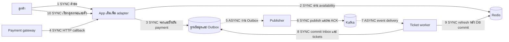
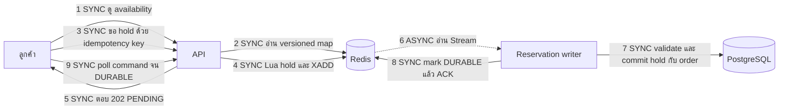
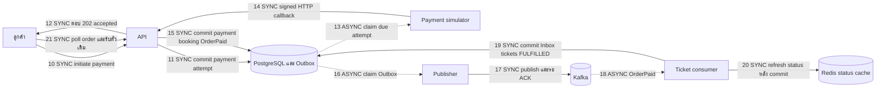

# การเพิ่ม Redis และ Kafka ในระบบขายตั๋วคอนเสิร์ตเดิม

สำหรับ developer team lead • ข้อมูล ณ 11 ตุลาคม 2026

ข้อเสนอคือเพิ่ม Redis เพื่อรองรับการดูที่นั่งและลดการแย่งทรัพยากรฐานข้อมูล และเพิ่ม Kafka เพื่อแยกงานออกตั๋วหลังชำระเงินออกจากคำขอของลูกค้า เริ่มจากส่วนที่กระทบระบบเดิมน้อยก่อน โดยให้ฐานข้อมูลยังยืนยันสิทธิ์ที่นั่ง การชำระเงิน และตั๋วที่ออกจริง ไม่จำเป็นต้องเปลี่ยนทั้งระบบเป็น microservices หรือย้ายทุกบริการขึ้น Kubernetes พร้อมกัน

เรามี backend และหลักฐานทดสอบสำหรับใช้เป็นต้นแบบ ยังไม่ใช่ผลิตภัณฑ์ที่รับรอง production capacity หรือ integration กับธนาคารจริง ต้องตรวจ schema, payment contract และคอขวดของระบบลูกค้าก่อนกำหนดงานเชื่อมต่อ

## ข้อเสนอที่ใช้คุยกับทีมพัฒนา

เป้าหมายคือขายสำเร็จ 300,000 ใบในหนึ่งชั่วโมง หรือเฉลี่ย 83.33 ใบต่อวินาที วัดจากตั๋วที่ชำระเงินและออกแล้ว ไม่ใช่ HTTP RPS การเพิ่ม Redis และ Kafka ช่วยแยกงานที่อ่านบ่อยและงานที่ทำต่อภายหลัง แต่ไม่ได้เพิ่มกำลังฐานข้อมูลโดยอัตโนมัติ

เริ่ม pilot ด้วย Redis สำหรับ reads และ Kafka สำหรับงานหลัง payment commit โดยคง transaction จองเดิม จากนั้นจึงประเมิน Redis-first หากการแย่งเขียนที่นั่งยังเป็นคอขวดและทีมพร้อมรองรับ PENDING กับ recovery ลำดับนี้เป็นข้อเสนอสำหรับประเมินร่วมกับลูกค้า ยังไม่ได้เปลี่ยนระบบของลูกค้าหรือเลือก topology ใหม่

## Redis และ Kafka ทำอะไร

| ส่วนประกอบ | ภาพที่ใช้ทำความเข้าใจ | ประโยชน์ในระบบ | สิ่งที่ต้องทำเพิ่ม |
| --- | --- | --- | --- |
| Redis | กระดานสถานะที่อ่านเร็วและตรวจพร้อมแก้ไขได้ในคำสั่งเดียว | ผังที่นั่งและ availability ที่มี version, rate limit, order-status cache; โหมดขั้นสูงรับ provisional hold และคำสั่งใน Stream | กำหนด freshness, expiry, backlog, durability และ failover contract |
| Kafka | บันทึกเหตุการณ์ให้ worker หลายกลุ่มอ่านและทำงานต่อได้ | ส่ง OrderPaid, TicketsIssued และเหตุการณ์ที่นั่ง; แยก ticket issuance และ projection; replay หลัง restart | Outbox, inbox, deduplication, lag monitoring และ dead-letter recovery |
| PostgreSQL | สมุดบัญชีและทะเบียนสิทธิ์ | Hold, order, payment, booking, ticket, idempotency, outbox และ inbox | Transactions, uniqueness, lock ordering และ connection budget |

Redis Stream ในต้นแบบรับ **คำสั่งจองที่ยังต้องบันทึก** ส่วน Kafka กระจาย **เหตุการณ์ที่บันทึกแล้ว** เป็นคนละเส้นทาง ไม่ต้องส่งคำขอจองผ่านทั้งสองระบบซ้ำกัน Kafka ไม่ใช่ตัวตัดสินว่าลูกค้าคนไหนได้ที่นั่ง

ตัวอย่าง: ลูกค้า 100 คนกด A1 พร้อมกัน Redis Lua ตรวจและกำหนด provisional owner แบบ atomic ในโหมด Redis-first แล้ว writer ตรวจและบันทึกผู้ชนะใน PostgreSQL อีกครั้ง หลัง payment commit จึงมี OrderPaid ส่งเข้า Kafka ให้ worker ออกตั๋ว Unique booking constraint ในฐานข้อมูลยังเป็นด่านสุดท้ายป้องกันขายที่นั่งซ้ำ

## จะเพิ่มเข้า app เดิมอย่างไร

ยังไม่ได้ตรวจระบบจริงของลูกค้า จึงไม่สรุปว่า app เดิมของเขามีปัญหาใด เริ่มจาก map เส้นทาง browse, hold, payment, callback, ticket issuance และ status polling เข้ากับองค์ประกอบต่อไปนี้

**เส้นทึบ SYNC:** caller รอผลของ operation นั้น **เส้นประ ASYNC:** ส่งต่อให้ทำภายหลัง งานภายใน worker ยังรอ database commit หรือ broker ACK ได้โดยไม่ทำให้ลูกค้าถือ payment request รอจนออกตั๋ว

App เดิมเพิ่ม Redis adapter สำหรับอ่าน และเขียน payment กับ outbox ใน transaction เดียว จากนั้นเพิ่ม publisher และ ticket worker เป็น process/container แยกได้ ไม่ต้องเริ่มด้วย Kubernetes หากฐานข้อมูลเดิมไม่ใช่ PostgreSQL ต้องมี transactions และ unique constraints ที่เทียบเท่ากัน ไม่จำเป็นต้องย้ายฐานข้อมูลเพื่อเริ่ม pilot

Frontend เดิมต้องเพิ่มสถานะ processing, การเรียกดู operation/ticket เดิม และ bounded retry ตาม contract แต่โครงการนี้ยังไม่ได้สร้าง frontend หรือ waiting room

## Flow ล่าสุดที่ใช้ในต้นแบบทดสอบ

มีสองโหมด: `RESERVATION_MODE=postgres` เป็นค่าเริ่มต้น ส่วน CCE test ล่าสุดใช้ `redis-first` Callback ยืนยันการเงินก่อนตอบ (`PAYMENT_CONFIRMATION_ASYNC=0`) แล้วออกตั๋วผ่าน Kafka ภายหลัง Feature รับ callback แบบ durable receipt มี implementation แต่ไม่ได้เปิดใน profile นี้

### การดูและถือที่นั่ง

`202 PENDING` หมายถึงรับคำสั่งและถือที่นั่งชั่วคราว ยังไม่ใช่ order ที่ PostgreSQL บันทึกครบ ต้องรอ `DURABLE` ก่อน checkout/payment ถ้า writer ช้า ระบบจำกัด backlog และอายุคำสั่ง ไม่เพิ่ม TTL เพียงเพราะ retry

โหมด PostgreSQL เริ่มต้นต่างกัน: API ใช้ Redis เป็น contention shield แล้วรอ DB transaction commit ก่อนตอบ hold สำเร็จ ไม่มี provisional acceptance แบบ Redis-first

### การชำระเงินและออกตั๋ว

Simulator เป็น gateway ตัวแทนสำหรับทดสอบ endpoint initiation นี้ปิดเมื่อไม่ใช่ development การเชื่อมธนาคารจริงต้องใช้ provider API, signature, idempotency, inquiry และ settlement reconciliation ไม่สามารถนำ simulator ไปใช้เป็น gateway production

Worker commit และคืน connection หลัง claim ก่อนทำ HTTP ไม่ถือ seat lock หรือ database connection ระหว่างรอ gateway อย่างไรก็ตาม initiate, callback และ status cache miss แต่ละครั้งยังใช้ transaction สั้น ๆ จึงยังต้องคุม connections

## ขั้นตอนไหน synchronous และ asynchronous

| ขั้นตอน | สิ่งที่รอและรูปแบบ | เมื่อสำเร็จหมายถึง |
| --- | --- | --- |
| ดูผังและ availability | SYNC HTTP และ Redis read | ได้ภาพสำหรับแสดงผล อาจเปลี่ยนก่อนกดจอง |
| Hold โหมด PostgreSQL | SYNC Redis shield และ DB commit | Hold และ order บันทึกแล้ว |
| Hold โหมด Redis-first | SYNC Lua/replica ACK แล้ว ASYNC writer | 202 คือ PENDING; writer commit แล้วจึง DURABLE |
| Poll command | แต่ละ read เป็น SYNC ขณะรอผล ASYNC | ไม่ถือ connection ระหว่างรอบ poll |
| เริ่ม payment simulator | SYNC commit attempt แล้ว ASYNC dispatch | 202 ไม่ใช่หลักฐานว่าเงินเข้า |
| Gateway confirmation | โดยรวม ASYNC หลัง initiation; callback HTTP เป็น SYNC | ใน profile ล่าสุด API รอ financial commit ก่อนตอบ sender |
| Optional receipt callback | SYNC commit receipt แล้ว ASYNC confirmation worker | ACK แปลว่ารับข้อมูล ไม่ได้ยืนยัน booking; ไม่เปิดในรอบล่าสุด |
| Publisher | ASYNC ต่อ customer; SYNC ต่อ broker ACK | Kafka รับ event แล้ว ยังไม่ออกตั๋วครบ |
| Ticket consumer | ASYNC ต่อ customer; SYNC DB transaction | Inbox, tickets และ FULFILLED commit พร้อมกัน |
| Availability/status refresh | ASYNC projection; Redis publish แต่ละครั้งเป็น SYNC | Advisory cache มีอายุ/version ไม่ใช่สิทธิ์การเงิน |
| รับตั๋วหรือ inquiry หลัง timeout | SYNC authorized read | คืน operation/ticket เดิม ไม่สร้าง payment ใหม่ |

Asynchronous หมายถึงแยกเวลาและผู้ทำงาน ไม่ได้หมายถึงไม่มี operation ไหนรอ หรือใช้ `async def` แล้วไม่ใช้ database resources

## Transaction และการป้องกันข้อมูลซ้ำ

1. **Hold persistence:** Hold, order, items, ownership, idempotency และ outbox commit พร้อมกัน ตรวจเวลาและสิทธิ์หลังได้ locks พร้อม database constraints
2. **Payment initiation:** หนึ่ง durable attempt ต่อ order และผล idempotency บันทึกก่อน dispatch ไม่เรียก network ใน seat transaction
3. **Callback:** ตรวจ signature, amount, currency, order และ expiry พร้อม dedup แล้ว commit payment, booking, order และ OrderPaid outbox พร้อมกัน
4. **Ticket issuance:** Inbox, tickets, FULFILLED และ event ถัดไป commit ใน DB ก่อน commit Kafka offset Unique booking-to-ticket reference ป้องกันตั๋วซ้ำ

**Outbox** คือแถวงานที่ commit พร้อม payment แก้ช่องว่าง “เงินถูกบันทึก แต่ส่ง Kafka ไม่สำเร็จ” Publisher ส่งภายหลัง **Inbox** คือใบรับงานของ consumer เพื่อจำว่า event ทำแล้ว

Kafka path นี้ใช้ **at-least-once delivery** ต้องคาดว่า event/callback อาจซ้ำ ผลทางธุรกิจหนึ่งครั้งเกิดจาก idempotency, inbox และ uniqueness ไม่ใช่ Kafka รับประกัน end-to-end exactly once ให้ธนาคารและ PostgreSQL อัตโนมัติ

## เมื่อระบบบางส่วนล้มเหลว

| เหตุการณ์ | Recovery และสิ่งที่รักษา |
| --- | --- |
| Redis รับ hold แต่ DB ยังไม่ commit | อยู่ PENDING; คำสั่งอยู่ใน Stream; writer retry/reclaim หลัง restart; deterministic conflict เป็น FAILED และคืนเฉพาะ hold token เดิม |
| DB commit แล้ว writer หยุดก่อน ACK | Replay command ID และ idempotency เดิม ไม่สร้าง order ที่สอง แล้ว mark DURABLE |
| Redis response หายหรือ WAIT ไม่ครบ | ผลไม่แน่นอน; replay เฉพาะ actor, payload และ key เดิม |
| Payment response หาย | อ่าน operation จาก PostgreSQL; ถ้ามีติดตาม order เดิม; replay ด้วย key เดิมเมื่อ contract อนุญาต |
| Temporary rejection | Retry ไม่เกินสาม HTTP attempts ภายใน deadline ด้วย jitter; ไม่ retry auth/payload/seat/expiry conflicts; operation lookup ไม่พร้อมห้าม blind payment replay |
| Callback ซ้ำหรือ late success | Dedup; ตรวจ expiry; late success ทำ refund request ไม่ยึดที่นั่งของผู้ถือใหม่ |
| Kafka ใช้ไม่ได้ | Payment commit ไม่หาย; Outbox ค้าง; ลูกค้าเห็น processing; คุม queue age และ backlog |
| Consumer หยุดหลัง DB commit | รับ event ซ้ำได้ Inbox และ unique references ป้องกัน repeated effects |
| Cache หาย | Seat map warming/fail closed แล้ว reconcile; order status มี bounded DB fallback พร้อม authorization |

Redis AOF everysec และ `WAIT` ลดความเสี่ยง แต่ไม่ได้รับประกันว่า acknowledged provisional writes จะไม่หายในทุก failover/node-loss scenario ต้องแยก atomicity ออกจาก durability และใช้ PostgreSQL DURABLE เป็น boundary สำคัญ

## ลำดับนำไปใช้กับระบบลูกค้า

| ระยะ | งาน | เกณฑ์ก่อนเดินต่อ |
| --- | --- | --- |
| 1 วัด app เดิม | แยกต้นทุน browse, hold, payment/callback, status; ตรวจ locks/pools | มี baseline และนิยาม tickets issued ร่วมกัน |
| 2 เพิ่ม Redis reads | Layout/availability, versions, prewarm, reconciliation, client backoff | DB reads ลดจริง freshness ผ่านและจองยังตรวจ DB |
| 3 เพิ่ม Kafka หลัง payment | Outbox/inbox และ ticket worker | Lost ACK, duplicates และ restart ไม่ทำข้อมูลซ้ำหรือหาย |
| 4 ประเมิน Redis-first | Event pilot, PENDING/DURABLE, bounded Stream และ expiry | Hold concurrency, persistence failure/replay และ failover contract ผ่าน |
| 5 Scale ตามหลักฐาน | แยก API/writer/publisher/consumer/projection คุม DB budget รวม | Paid-ticket throughput เพิ่มโดย errors และ queue age อยู่ในเกณฑ์ |
| 6 รับรอง flash opening | Hot-seat, simultaneous arrivals, gateway latency, retry และหนึ่งชั่วโมง | เป้าตั๋ว unique พร้อม customer gates, zero double-booking/payment loss และ drain |

หนึ่ง event ต้องมีเส้นทางตัดสินการจองที่ชัดเจน ไม่เปิด app เดิมและ Redis-first แย่งเขียนโดยไม่มี ownership contract ระหว่าง rollout เก็บ image digest, configuration และ budgets; rollback ต้องจัดการคำสั่งค้างและข้อมูลที่ commit แล้วก่อนสลับเส้นทาง

Redis/Kafka ไม่จำเป็นต้องมาพร้อม CCE สามารถเพิ่ม worker ใน ECS หรือ container environment เดิมก่อน เลือก managed Kafka หรือ broker ที่ทีมดูแลตามงบและความพร้อม การย้าย deployment กับการเปลี่ยน transaction เป็นคนละ decision

## หลักฐานที่ใช้คุยกับทีม lead

| การทดสอบ | ผล | ข้อจำกัด |
| --- | --- | --- |
| CCE หนึ่งชั่วโมง 9 ตุลาคม | 302,262 unique paid-and-issued tickets ภายในชั่วโมง; zero double-booking/payment loss ใน audited cohort | Payment 503 หนึ่ง journey และ telemetry ไม่ครบ; FAILED_RESTORED ยังไม่ผ่าน production qualification |
| Recovery comparison 10 ตุลาคม | แต่ละ arm 25,200 scheduled/dispatched; zero drops/final failures; candidate payment 503 สามครั้งกู้คืนครบ | ห้านาทีรวม completion tail; ไม่รับรองตั๋วทั้งหมดภายใน window หรือ live-bank charging |
| Capacity ล่าสุด 10 ตุลาคม | Offered 168 journeys/s; 22,101 ใบใน 300s = 73.67 ใบ/s; หลัง drain 31,666 ใบ | Generator timeout ไม่เก็บ customer summary; error/drop/latency ไม่ทราบ; เป้า 50,000 ใบไม่ผ่าน |

ผลล่าสุดคูณหนึ่งชั่วโมงได้ **265,212 ใบเป็น extrapolation เท่านั้น** ไม่ใช่ clean sustained capacity ผล 9 ตุลาคมเป็นคนละ version/config/workload จึงใช้รับรองระบบล่าสุดไม่ได้ รอบล่าสุดกระจาย 168 shows ไม่ใช่ลูกค้าทุกคนแย่ง concert เดียวตอนเปิดขาย 10.00

Topology ล่าสุดที่ทดสอบ: CCE API 4 pods (1 vCPU/2 GiB ต่อ pod), background 14 pods (250m/512 MiB ต่อ pod): writers 3, ticket consumers 6, projection consumer 1, publisher/maintenance/reconciler/simulator อย่างละ 1 ใช้ shared application image digest เดียวกัน RDS/DCS เป็น managed services; routing, Kafka และ PgBouncer ยังพึ่ง ECS ใน pilot จำกัด physical DB connections รวม 24 ค่า per-process pools ไม่ใช่จำนวน connection ถึง RDS จริง ทั้งหมดเป็น **test topology** ไม่ใช่ sizing recommendation สำหรับลูกค้า

ข้อความเสนอทีม lead: “เราต้องการ pilot ย้าย repeated reads ไป Redis และแยกงานออกตั๋วหลัง payment commit ผ่าน Kafka โดยคงฐานข้อมูลยืนยันสิทธิ์ ใช้ failure tests และ paid-and-issued tickets เป็นเกณฑ์ ก่อนย้ายเส้นทางจองหรือเพิ่มเครื่อง”

## เรื่องที่ต้องตกลงกับทีมลูกค้า

- Schema และ ownership ปัจจุบัน: ใครเขียน seat/show/booking และกัน double-booking อย่างไร?
- Gateway contract: มี idempotency, webhook retry, inquiry และ refund หลัง expiry อย่างไร?
- Customer SLO: availability/status สดแค่ไหน รอ processing ได้กี่วินาที final error target เท่าไร?
- กฎธุรกิจ: multi-seat all-or-nothing, quota และ purchase limits ต้องรักษาอะไรบ้าง?
- Operations: ใครดูแล lag, dead letters, Redis failover, reconciliation และ settlement?

## เอกสารและหลักฐานอ้างอิง

- [Redis-first contract](../redis-first-reservations.md), [API](../../src/ticketing/api.py), [reservation transactions](../../src/ticketing/infrastructure/reservations.py), [Redis intake](../../src/ticketing/infrastructure/redis_reservations.py), [workers](../../src/ticketing/workers.py)
- [ADR0254 recovery](../adr/0254-recover-customer-payment-and-confirmation.md), [ADR0258 shared image](../adr/0258-shared-application-image-and-separate-cce-services.md), [ADR0277 latest experiment](../adr/0277-five-minute-fifty-thousand-ticket-capacity-test.md)
- [Hourly milestone](../capacity/flash-sale-opening/cce-hourly-milestone-2026-10-09.md), [recovery comparison](../capacity/cce/customer-recovery-comparison-2026-10-10.json), [latest result](../capacity/cce/fifty-thousand-ticket-result-2026-10-10.json)
- หลักการจากผู้พัฒนา: [Redis Lua atomicity](https://redis.io/docs/latest/develop/programmability/eval-intro/), [Redis WAIT limitations](https://redis.io/docs/latest/commands/wait/), [Kafka delivery semantics](https://kafka.apache.org/41/design/design/), [PostgreSQL uniqueness](https://www.postgresql.org/docs/current/ddl-constraints.html)

ติดตาม API CPU, Redis command time, writer queue age, Kafka lag, DB acquisition/lock/commit waits, customer recovery และ tickets issued ร่วมกัน การเพิ่ม pods อย่างเดียวอาจเพิ่มภาระ database แทนที่จะเพิ่มยอดขายสำเร็จ
