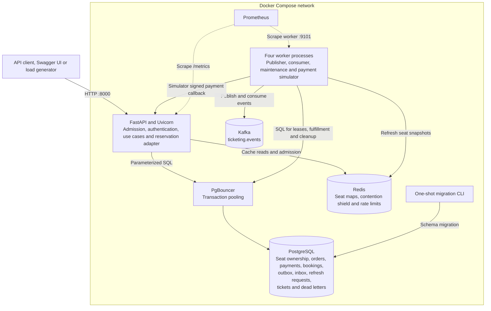
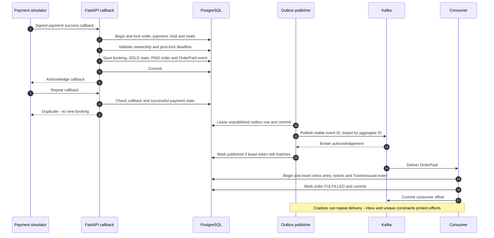

# System diagrams

These Mermaid diagrams show the implemented local MVP. GitHub renders them directly from Markdown. Component labels describe logical roles; all Python services use the same application package.

## Runtime topology

### Read and write responsibilities

| Component | Responsibility |
|---|---|
| API | Event browsing, cached seat reads, holds, order lookup, payment initiation and callback handling |
| PostgreSQL | Final authority for seat ownership and payment/order effects |
| Redis | Fast advisory reads and request admission; never grants a confirmed booking |
| PgBouncer | Bounds backend database connections shared by application processes |
| Publisher worker | Leases outbox rows, sends to Kafka and marks publication after acknowledgement |
| Consumer worker | Issues tickets, settles simulated refunds, queues durable cache refreshes and deduplicates effects |
| Maintenance worker | Expires old holds without waiting on busy locks leases coalesced refresh work and periodically rebuilds seat maps |
| Simulator worker | Uses four bounded threads to lease attempts and send signed duplicate HTTP callbacks |
| Prometheus | Scrapes metrics; it does not participate in reservation decisions |
| Migration CLI | Connects directly to PostgreSQL before application startup |

The worker box represents four separate Compose services. They do not all perform every arrowed operation; the table identifies each role. Migrations and isolated integration tests can access PostgreSQL directly; normal application database access goes through PgBouncer.

Event metadata reads use PostgreSQL. Seat-map reads use Redis, including the polling delta endpoint. A cache miss or outage returns 503 rather than causing a seat-map query stampede into PostgreSQL.

## Payment event delivery and recovery

This sequence assumes a valid, unexpired hold and a successful payment. SQL connections pass through PgBouncer; it is omitted here for readability.

- A late successful payment writes RefundRequested instead of creating bookings. Its consumer updates the simulated refund and order to REFUNDED.
- SeatsChanged commits a durable refresh generation together with its inbox entry. Maintenance
  coalesces requests, leases a generation, rebuilds Redis, and acknowledges that generation only
  with the matching lease token. Inbox completion is not proof of cache freshness; monitor the
  refresh queue and cache version. See [ADR 0008](adr/0008-bounded-background-processing.md).
- TicketsIssued follows the same outbox path and produces a development notification log.
- A publication crash after broker acknowledgement can repeat the event ID.
- A consumer crash after its database commit can redeliver the event; its inbox record prevents repeated transactional effects.
- After five failed processing attempts, the consumer persists a dead letter before advancing its Kafka offset. If that persistence fails, it seeks back to the message.
- Aggregate partition keys do not imply global ordering or guarantee publication order across multiple publishers. Handlers are designed to tolerate replay and relevant reordering.

## Operational endpoints and storage

| Service | Local endpoint / storage |
|---|---|
| API | 127.0.0.1:8000; /docs, /openapi.json, /health/live, /health/ready, /metrics |
| PostgreSQL | 127.0.0.1:5432; postgres-data named volume |
| Redis | 127.0.0.1:6379; cache is recoverable from PostgreSQL |
| Kafka | Internal kafka:9092; kafka-data named volume |
| Worker metrics | Internal port 9101 in each worker container |
| Prometheus | 127.0.0.1:9090 |

The API's readiness check uses PostgreSQL and Redis. Kafka outages can delay fulfillment while valid payment callbacks still commit safely. Compose waits for Kafka during initial application startup; that startup dependency is distinct from runtime booking correctness.

## Diagram scope and evidence

These diagrams do not claim high availability, a production capacity level or end-to-end exactly-once delivery. The measured stress-test latency limits and rejection rates are documented in the [load-test report](load-test-report.md).

Sources in this repository: [Compose](../compose.yaml), [API](../src/ticketing/api.py), [workers](../src/ticketing/workers.py), [database adapter](../src/ticketing/infrastructure/postgres.py), [reservation transactions](../src/ticketing/infrastructure/reservations.py), and [schema](../migrations/001_initial.sql).

Related: [application flow](application-flow.md), [technology stack](tech-stack.md), [concurrency contract](architecture.md).
